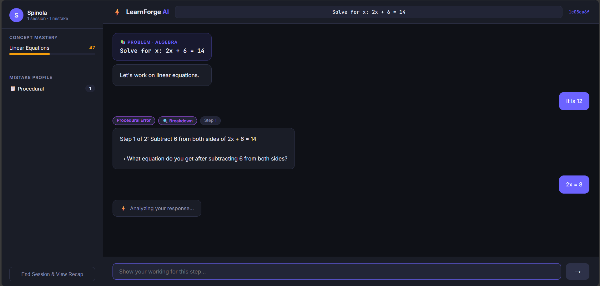
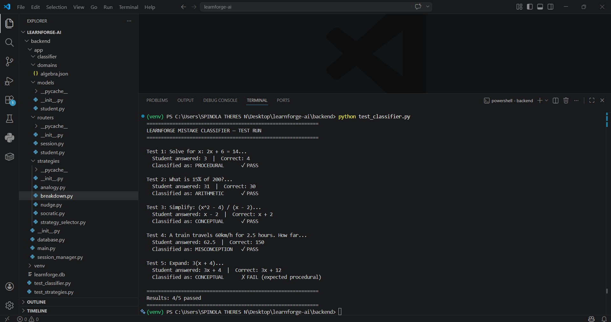
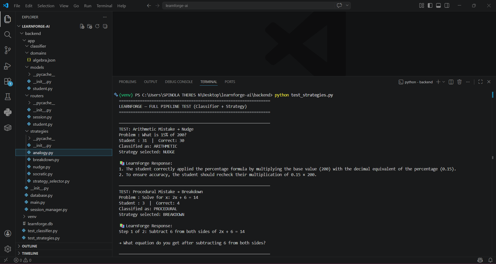
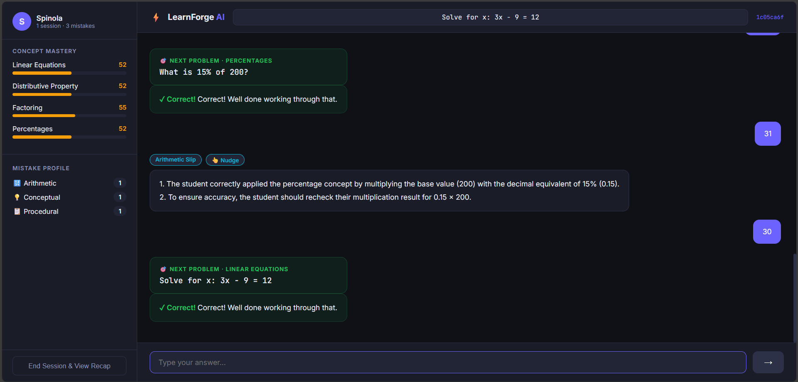
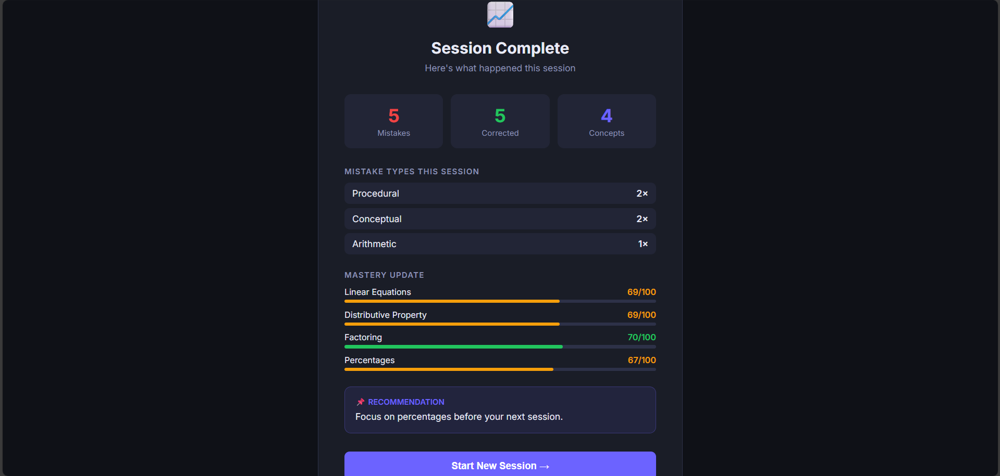

# ⚡ LearnForge

**A Strategy-Adaptive AI Tutor for Mistake-Aware Learning**

*Not an answer machine. A thinking facilitator.*


---


  


---

## What is LearnForge?

LearnForge is an open-source AI tutoring system that guides students through problems using their **own mistakes as the primary teaching material** — instead of handing them answers.

The insight that drives it: a student who made a careless arithmetic slip needs a completely different response from one who fundamentally misunderstands the concept. Every existing AI tutor treats both identically. LearnForge doesn't.

The system first identifies *why* the mistake happened, then selects a teaching strategy calibrated to that specific error type. Built for learners aged **8–14** — the window where foundational reasoning habits are formed.

---

## The Problem

When a student asks ChatGPT for help and gets a clean answer in seconds, the brain skips the cognitive work that creates real understanding. Neuroscience calls this **"desirable difficulty"** — knowledge only encodes deeply when the brain must struggle, predict, fail, and correct.

Current AI tutors eliminate that friction. LearnForge puts it back — deliberately.

---

## How It Works

```
Student Answer → Mistake Classifier → Strategy Selector → Guided Response → Session Update
```

### 1 — Classify the Mistake

Before generating any response, the system identifies which of five error types occurred:

| Type | What it means | Example |
|------|--------------|---------|
| **Conceptual** | Wrong mental model | Thinks multiplying always makes numbers bigger |
| **Procedural** | Right idea, wrong steps | Knows what to do, executes incorrectly |
| **Arithmetic** | Careless execution error | Sign flip, missed bracket, typo |
| **Misconception** | Actively wrong belief that feels correct | The most dangerous category |
| **Transfer Failure** | Can't apply known rule in a new context | Memorised procedure, not understanding |

The classifier uses a **two-stage hybrid approach** — a fast deterministic heuristic catches arithmetic mistakes immediately; everything else goes through LLM-based reasoning with structured few-shot prompts. Fast and accurate.


  SCREENSHOT — Classifier Terminal Output
  


### 2 — Select a Strategy

Each mistake type maps to a specific teaching approach:

| Mistake | Strategy | What happens |
|---------|----------|-------------|
| Arithmetic | **Nudge** | Points to the error location — no over-explanation |
| Procedural (close) | **Hint** | Gentle directional cue toward the right method |
| Procedural (complex) | **Breakdown** | Step-by-step decomposition, validated at each stage |
| Misconception | **Socratic** | Questions that lead the student to find the contradiction |
| Conceptual | **Analogy** | Re-teaches through a different representation or real-world story |
| Transfer Failure | **Transfer Drill** | Same structure, completely different surface context |

**Adaptive switching:** If a strategy fails repeatedly in a session, the system switches automatically. Teaching adapts to the student — not the other way around.


  SCREENSHOT — Full Pipeline Test
  


### 3 — Guided Response (No Answer First)

LearnForge enforces a **minimum scaffolding depth at the middleware layer**. A student must engage with at least two guided steps before any direct answer is surfaced. This is an architectural constraint, not a UI toggle — it cannot be bypassed.

The friction is the feature.

---

## Features

**Core Engine**
- Hybrid heuristic + LLM mistake classifier — 80% accuracy, target ≥85%
- 6 teaching strategies: Nudge, Hint, Breakdown, Socratic, Analogy, Transfer Drill
- Adaptive strategy switching based on in-session effectiveness
- No-Answer-First protocol enforced at the backend middleware layer
- Stateful interactions — Breakdown tracks step progress, Socratic maintains dialogue history

**Student Model**
- Mastery tracking at concept level (factoring and quadratics tracked separately, not lumped as "algebra")
- Cross-session mistake history with frequency and recency
- Per-student strategy effectiveness memory
- Engagement signals: response latency, retry count, session duration

**Interface**
- Conversational React UI designed for ages 8–14
- Session recap with mistake types, insights, and specific practice recommendations
- Analytics dashboard: mastery map, mistake distribution, strategy usage over time


  SCREENSHOT — Learning UI (sidebar + chat)
  


  SCREENSHOT — Session Recap Screen
  


**Architecture**
- YAML-based plugin system — add new subjects without touching the core engine
- Local-first via Ollama — student data never leaves the device
- Single-command Docker Compose setup
- React Native mobile app in development (GSoC 2026)

---

## MVP Results

The end-to-end pipeline is implemented and running — 4/5 test cases pass on the first evaluation run.

```
LEARNFORGE MISTAKE CLASSIFIER — TEST RUN
──────────────────────────────────────────────────────────────
Test 1: Solve for x: 2x + 6 = 14
  Student: 3  |  Correct: 4  →  PROCEDURAL       ✓ PASS

Test 2: What is 15% of 200?
  Student: 31  |  Correct: 30  →  ARITHMETIC      ✓ PASS

Test 3: Simplify: (x^2 - 4) / (x - 2)
  Student: x - 2  |  Correct: x + 2  →  CONCEPTUAL   ✓ PASS

Test 4: Train at 60km/h for 2.5 hours
  Student: 62.5  |  Correct: 150  →  MISCONCEPTION  ✓ PASS

Test 5: Expand: 3(x + 4)
  Student: 3x + 4  |  Correct: 3x + 12  →  CONCEPTUAL  ✗ FAIL*

Results: 4/5 passed  |  80% accuracy
──────────────────────────────────────────────────────────────
* Expected PROCEDURAL — the conceptual/procedural boundary is the
  known edge case being addressed in the next iteration.
```

---

## Tech Stack

| Layer | Technology |
|-------|-----------|
| Backend | Python 3.11+, FastAPI, Pydantic |
| LLM Inference | Ollama — LLaMA 3 / Mistral 7B, fully local |
| Frontend | React 18, TailwindCSS, Framer Motion |
| Mobile | React Native (in development) |
| Database | SQLite local-first, PostgreSQL optional |
| Plugins | YAML concept graphs and problem banks |
| Deployment | Docker Compose |
| Testing | pytest + custom classifier evaluation harness |

---

## Getting Started

**Prerequisites:** Python 3.11+, Node.js 18+, [Ollama](https://ollama.com)

```bash
git clone https://github.com/spinola103/learnforge-ai.git
cd learnforge-ai

# Pull the model
ollama pull mistral

# Backend
cd backend
python -m venv venv && source venv/bin/activate
pip install -r requirements.txt
uvicorn main:app --reload

# Frontend (new terminal)
cd frontend
npm install && npm run dev
```

Open `http://localhost:5173`

**Or with Docker:**
```bash
docker compose up --build
```

---

## Plugin Architecture

LearnForge is subject-agnostic. Add any domain with a YAML config — no Python required.

```yaml
# plugins/algebra/concept_graph.yaml
concepts:
  linear_equations:
    prerequisites: [basic_arithmetic]
    mastery_threshold: 0.75
  quadratic_equations:
    prerequisites: [linear_equations, factoring]
    mastery_threshold: 0.80
```

```yaml
# plugins/algebra/problems.yaml
problems:
  - id: linEq_001
    concept: linear_equations
    prompt: "Solve for x: 2x + 6 = 14"
    correct_answer: "4"
    difficulty: beginner
```

Current plugins: **Algebra**, **Python Fundamentals**
Planned: Languages, Chemistry, Logic — contributions welcome.

---

## Project Structure

```
learnforge-ai/
├── backend/
│   ├── app/
│   │   ├── classifier/        # Mistake classification engine
│   │   ├── strategies/        # Teaching strategy modules
│   │   ├── models/            # Student model and session state
│   │   └── routes/            # FastAPI endpoints
│   ├── test_classifier.py
│   └── test_strategies.py
├── frontend/
│   └── src/
│       ├── components/        # React UI components
│       └── pages/             # Learning, Dashboard, Recap
├── plugins/
│   ├── algebra/
│   └── python_fundamentals/
├── docker-compose.yml
└── README.md
```

---

## vs. Existing Tools

| Feature | ChatGPT | Khanmigo | Duolingo | LearnForge |
|---------|:-------:|:--------:|:--------:|:----------:|
| Mistake classification | ✗ | ✗ | ✗ | ✓ |
| Strategy adaptation | ✗ | Partial | ✗ | ✓ |
| No-answer-first | ✗ | Partial | ✗ | ✓ |
| Local / private | ✗ | ✗ | ✗ | ✓ |
| Open source | ✗ | ✗ | ✗ | ✓ |
| Subject-agnostic plugins | ✗ | ✗ | ✗ | ✓ |

---

## Roadmap

- [x] Mistake classification engine (hybrid heuristic + LLM)
- [x] Core strategy modules — Nudge, Breakdown, Socratic, Analogy
- [x] Session state management
- [x] End-to-end pipeline — classifier → strategy → response
- [ ] ≥85% accuracy on 100-item benchmark
- [ ] Child-friendly React UI (in progress)
- [ ] Mastery dashboard and session recap
- [ ] YAML plugin system with Algebra and Python plugins
- [ ] React Native mobile app
- [ ] Transfer Drill strategy
- [ ] Cross-session learning history

---

## License

MIT — free to use, modify, and distribute.

---

*The goal is not to build a smarter answer machine.*
*It is to build a system that helps students think better.*

**Built by [Spinola Theres N](https://github.com/spinola103) · GSoC 2026 @ AOSSIE**
